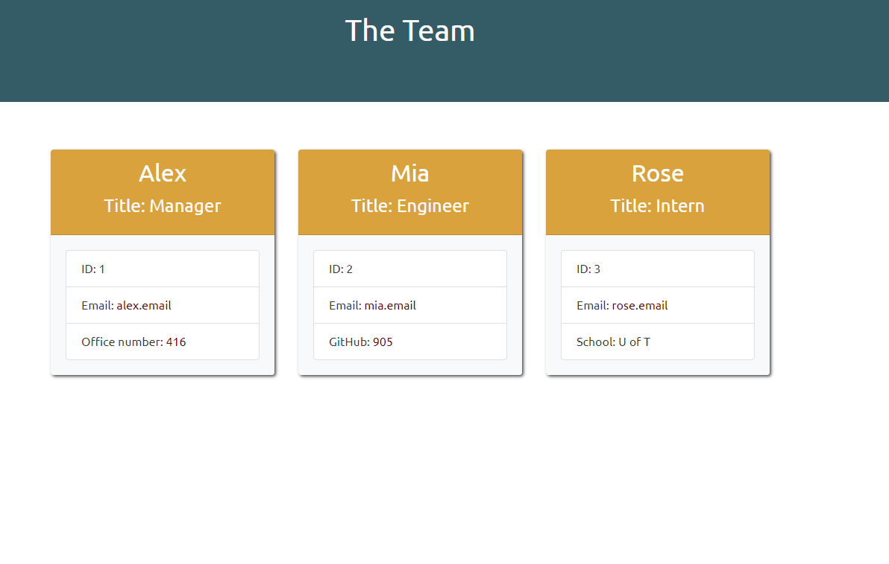
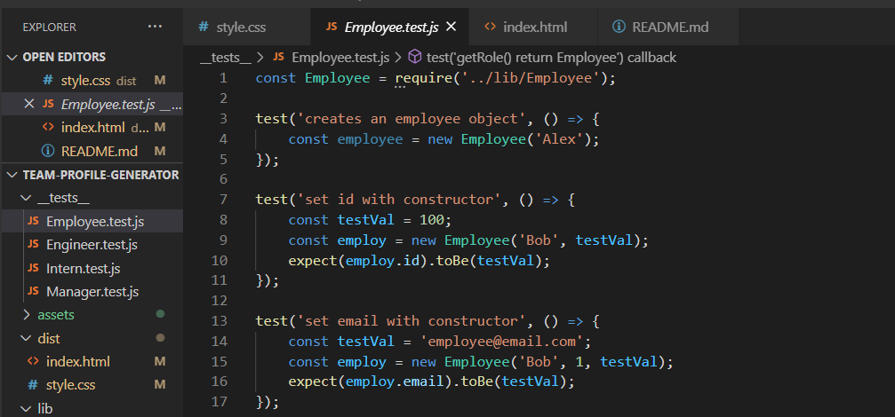

# Team Profile Generator
Application that generates a team profile

## Table of Contents
* Overview
* Technologies
* Status
* Screenshot

## Overview
This is an assignment using Node and JS. The goal of the assignment is to create an app that generates a team profile generator file for the user. The below link will guide the user how to use the application. I have included a screenshot of the appication's test code and the end result.

## Technologies
Project created with:
* Node
* JS
* Jest
* Inquirer
* Path

## Status
To view a user guide of my project please visit the below.

[Team Profile Generator Guide](https://drive.google.com/file/d/1zj-g0T2CSmvNBaGs6V3Re4bW9WDt5okq/view)

## Screenshot

)
)
